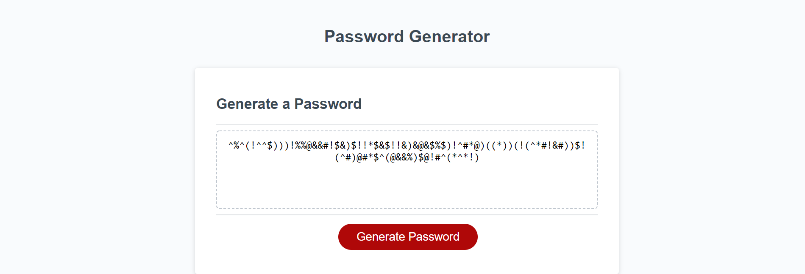

# Password Generator

## Description

Password Generator accepts four different character types and randomly generates a secure password using the selected character types.

## Preview

## Roadmap

Looking to figure out a way to ensure one of each character type selected gets included without fail but also without sacrificing randomness.

## Contributing

Any input or solutions are appreciated via opening issues on GitHub.